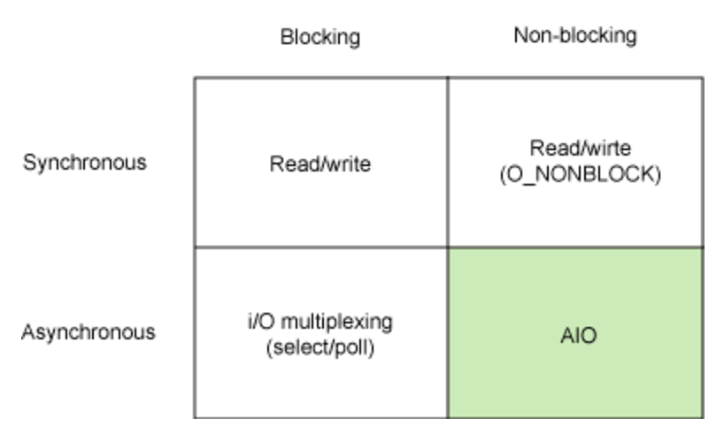
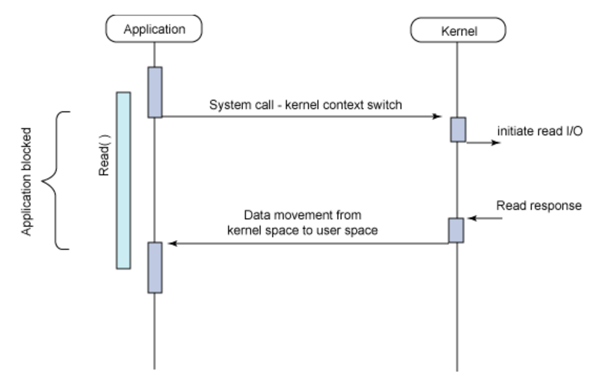
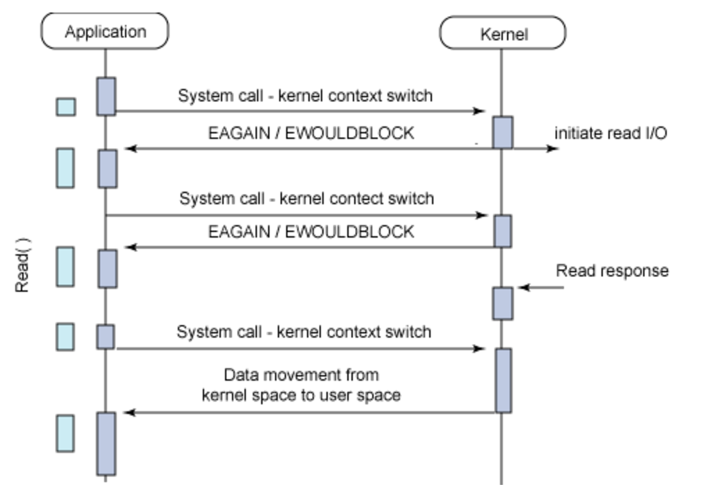
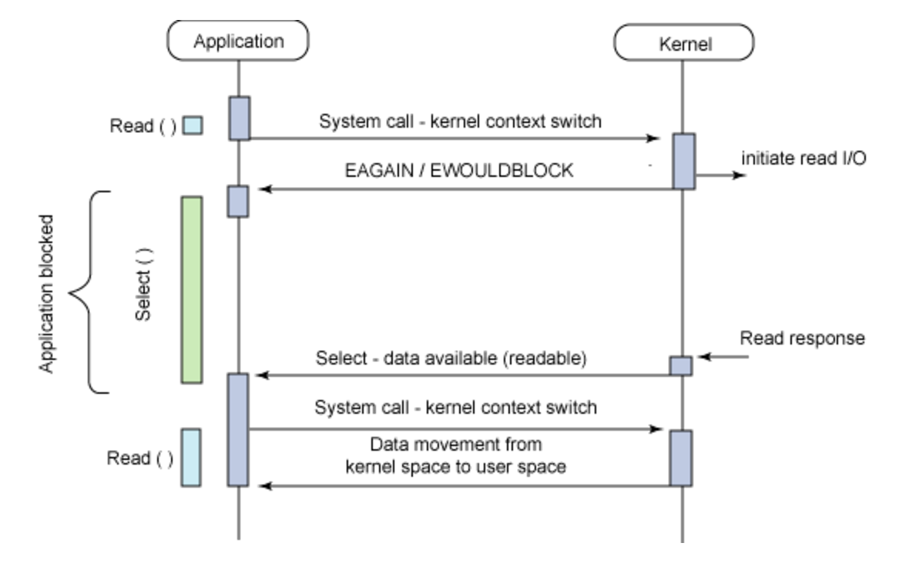
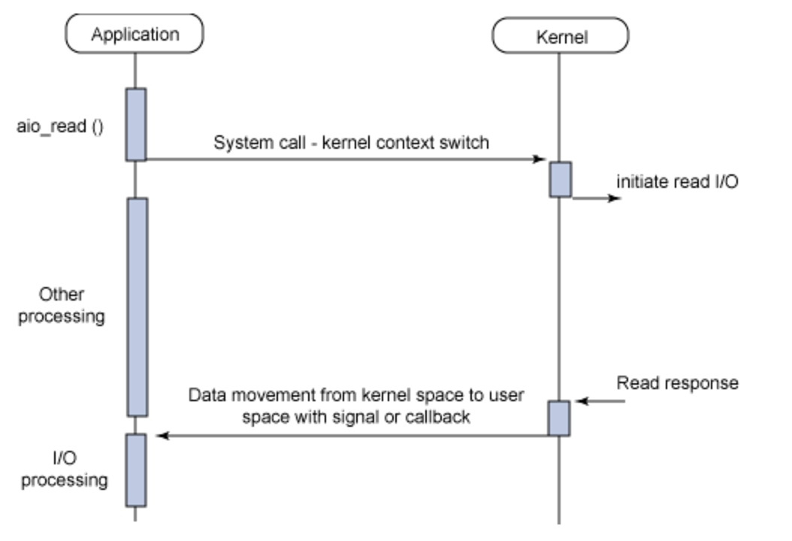

# 용어 정리

I/O와 관련된 글을 읽다보면, blocking. non-blocking. synchronous, asynchronous와 같은 개념이 자주 등장한다. 예전에 해당 내용을 다루긴 했지만 지금 보니 내용이 많이 부실해서 다시 정리해두려고 한다.

## Blocking

blocking은 간단히 설명하자면 어떤 함수를 호출한 후 결과가 나올때까지 다음 작업을 진행하지 않는 것을 말한다.

따라서 Blocking I/O 작업이 진행되면 그동안 유저프로세스는 자신의 작업을 모두 중단하고 대기해야 한다. 그런데 I/O작업이 CPU자원을 거의 사용하지 않기 때문에 이런 형태의 I/O는 리소스 낭비가 심하다. 

## Non-Blocking

반면 non-blocking의 경우 결과가 나올때까지 기다리지 않고 다음 작업을 수행하는 것을 말한다.

따라서 non-blocking I/O작업을 진행하는 동안 유저프로세스의 작업을 중단시키지 않는다. 유저프로세스가 커널에게 I/O를 요청하는 함수를 호출하면, 함수는 I/O를 요청한 다음 진행상황과 상관없이 바로 결과를 반환한다.

## Sync

sync(동기)는 순서가 정해져있는 것을 말하는데, blocking과 비슷하지만 조금 다르다.

## Async

반면 async(비동기)는 순서가 정해져있지 않은것을 말한다. 

# I/O Model

따라서 I/O Model은 위의 특성들을 Sync와 Async. blocking과 non-blocking을 각각 나누어 Synchronous blocking I/O, Asynchronous blocking I/O, Synchronous non-blocking I/O, Asynchronous non-blocking I/O의 네 가지로 나눌 수 있다.

## Synchronous blocking I/O

* 가장 흔한 모델
* user-level에서 blocking 발생시키는 System call
* 때문에 하나의 작업당 하나의 user-level, kernel-level의 context switching 발생
* 정지된 프로세스는 CPU를 사용하지 않고 커널의 응답만 기다림.
* 응답을 받으면 프로세스는 blocking에서 풀리며 데이터 역시 user-level 버퍼로 돌아옴.
* 생각보다 효율적이고 구현도 쉬움. 이해하기 쉬움.
* 개선 포인트는 CPU를 사용하지 않아서 느리다는 점.

## Synchronous non-blocking I/O

* I/O작업을 커널에게 넘긴 후 시스템콜을 통해 커널에 계속 물어보는 방식.
* 커널은 완료되지 않으면 에러코드(EAGAIN / EWOULDBLOCK) 반환. 
* Synchronous blocking I/O의 개선안이지만 시스템콜을 자주 해야하고 context switching이 빈번하게 일어나게 되므로 오버헤드 큼.
* 때문에 Synchronous blocking I/O보다 더 비효율적.

## Asynchronous blocking I/O

* I/O는 non-blocking으로 수행하고 알림(notification)은 blocking으로 수행.
* Select 시스템 콜이 어플리케이션을 block시킴.
* Select()는 IO descriptor에 대해 알림 기능을 수행하는데 하나가 아니라 여러개에 대해 알림기능 수행한다고 함.
* Select()는 근데 비효율적이라 고성능은 아님.

## Asynchronous non-blocking I/O (AIO)

* 시스템콜이 즉시 IO 수행 여부를 반환
* IO는 백그라운드에서 진행되고 애플리케이션은 그동안 다른 일을 함.
* IO에 대한 response가 도착하면 signal이나 쓰레드 기반의 callback으로 IO완료 여부를 알려줌
