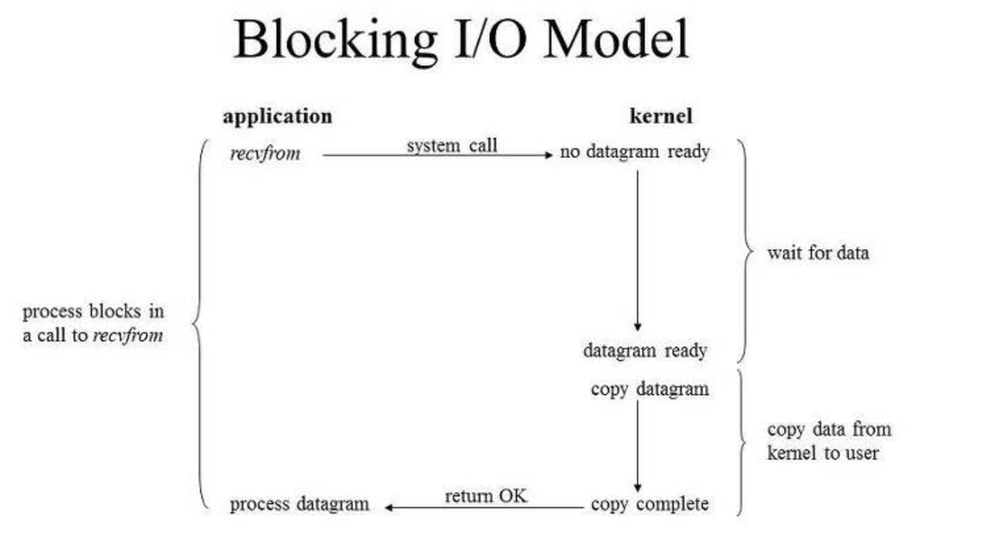
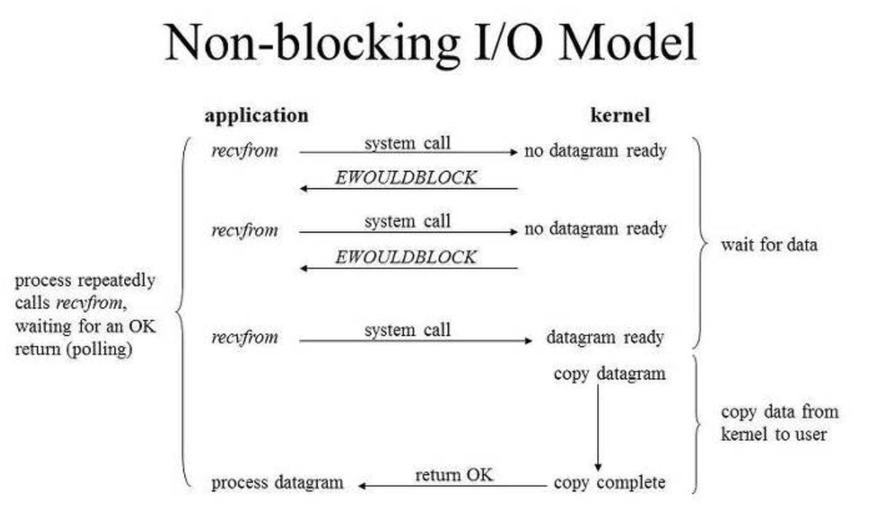

# I/O Model

I/O와 관련된 글을 읽다보면, blocking. non-blocking. synchronous, asynchronous와 같은 개념이 자주 등장한다. 예전에 해당 내용을 다루긴 했지만 지금 보니 내용이 많이 부실해서 다시 정리해두려고 한다.

## Blocking

I/O는 유저레벨이 아니라 커널레벨에서만 가능하다. 따라서 유저프로세스(혹은 쓰레드)는 커널에게 I/O를 요청해야만 한다. I/O에서 블로킹 형태의 작업(Blocking I/O)은 유저 프로세스가 커널에게 I/O를 요청하는 함수를 호출하고, 커널이 작업을 완료하면 함수가 작업 결과를 반환한다.

Blocking I/O 작업이 진행되는동안 유저프로세스는 자신의 작업을 모두 중단하고 대기해야 한다. 그런데 I/O작업이 CPU자원을 거의 사용하지 않기 때문에 이런 형태의 I/O는 리소스 낭비가 심하다. 

## Non-Blocking

Non-Blocking은 I/O작업을 진행하는 동안 유저프로세스의 작업을 중단시키지 않는다. 유저프로세스가 커널에게 I/O를 요청하는 함수를 호출하면, 함수는 I/O를 요청한 다음 진행상황과 상관없이 바로 결과를 반환한다.
